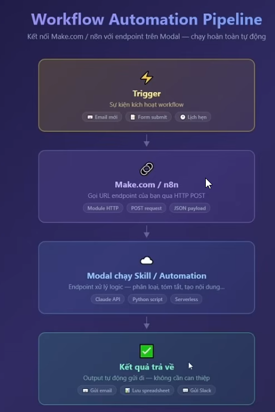
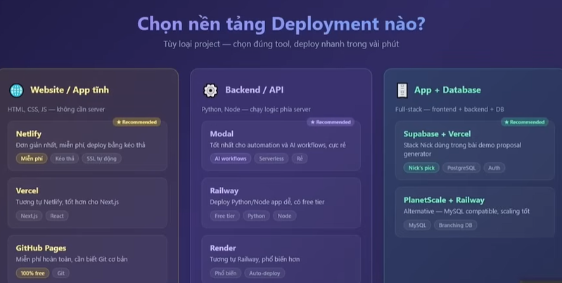

# Nội dung chữ trên màn hình — "Học Claude Code từ con số 0" (youtube.com/watch?v=g-ZtK5u-iiw)

> Trích từ các khung hình có thay đổi cảnh (scene-change) trong video, tập trung vào các chương: CLAUDE.md, thư mục `.claude/`, MCP, Hooks, Sub-Agents/Agent Teams, Git Worktrees/Deploy. Một số đoạn chữ nhỏ ở độ phân giải 480p có độ tin cậy thấp hơn, đã ghi chú rõ.

## (ảnh chụp bổ sung, chưa rõ mốc thời gian chính xác — khả năng ở phần intro/mục lục đầu video) — Slide mục lục nội dung
```
**Phần 1 – Nền tảng:**
- Setup Claude Code từ đầu — cài đặt từng bước, dù bạn chưa biết gì
- Hiểu Terminal và các công cụ làm việc — tôi sẽ giải thích đơn giản nhất có thể
- Chọn IDE phù hợp — tôi so sánh 3 loại phổ biến để bạn chọn đúng

**Phần 2 – Thực hành ngay:**
- CLAUDE.md — đây là thứ quan trọng nhất khi làm việc với Claude Code
- Build web app đầu tiên — bạn sẽ tự tay làm trong bài học này
- Verification — cách kiểm tra để AI không làm sai mà bạn không biết

**Phần 3 – Nâng cao:**
- Context Management — tại sao Claude Code hay 'quên' và cách fix
- MCP — kết nối Claude Code với Gmail, Drive, và hàng trăm app khác
- Skills và Sub-agents — biến Claude Code thành đội ngũ tự động hóa
- Agent Teams — nhiều AI làm việc song song cho bạn
- Deployment — đưa automation lên production thật sự
```

## 00:03:09 — Slide "Thông tin lưu vào memory" (rất rõ)
```
- Tên và thông tin thành viên team
- Preference cá nhân
- Thông tin dự án được nhắc tới
- Các quyết định kỹ thuật quan trọng
```
- ⚠️ **Đính chính (đã kiểm tra với docs.claude.com):** đây thực chất là nội dung nên ghi vào **CLAUDE.md** (file bạn tự viết), không phải một tính năng "memory" riêng. Claude Code có `MEMORY.md` (viết hoa) do Claude *tự* ghi tại `~/.claude/projects/<project>/memory/`, nằm ngoài repo và không phải chỗ bạn thủ công liệt kê team/preference/quyết định kỹ thuật như slide mô tả. Xem thêm đính chính ở mục 00:44:04 bên dưới về `memory.md` trong cây thư mục `.claude/`.

## 00:08:23–00:10:24 — Trang tải Node.js / PowerShell
- nodejs.org/en/download — bản v24.14.0 LTS, lệnh Docker (`docker pull node:24-alpine`, `docker run -it --rm ...`), nút "Windows Installer (.msi)" / "Standalone Binary (.zip)"
- Cửa sổ PowerShell: "Windows PowerShell / Copyright (C) Microsoft Corporation. All rights reserved. / Try the new cross-platform PowerShell https://aka.ms/pscore6 / PS C:\Users\Admin>"

## 00:09:57 — Claude Code Docs (code.claude.com/docs)
- Lệnh cài đặt:
  - macOS/Linux/WSL: `curl -fsSL https://claude.ai/install.sh | bash`
  - Windows PowerShell: `irm https://claude.ai/install.ps1 | iex`
  - Windows CMD: `curl -fsSL https://claude.ai/install.cmd -o install.cmd && install.cmd`
  - Ghi chú: "Windows requires Git for Windows. Install it first if you don't have it."
  - Bắt đầu dự án: `cd your-project` rồi `claude`

## 00:11:00–00:11:20 — Desktop Windows 10, mở PowerShell mới

## 00:12:12 — Claude Code khởi động lần đầu (terminal)
- ASCII art logo, "Welcome to Claude Code v2.1.25"
- "Opening browser to sign in..."
- Sau đăng nhập: "Logged in as erhot.thanhvn@gmail.com" / "Login successful. Press Enter to continue..."

## 00:15:34 — Windows Explorer, thư mục C:\Users\Admin
- Danh sách thư mục cá nhân của người dạy (Desktop, Downloads, Documents, .vscode, .claude, .bash_history, .gitconfig, hello.txt...) — chỉ minh hoạ thư mục làm việc.

## 00:15:53–00:15:57 — Terminal Claude Code, menu "/skills"
- "hey, bạn có thể làm gì cho tôi" → liệt kê nhóm chức năng:
  - **Code & Development**: Viết code, sửa bug, refactor / Giải thích code, review code / Tạo file, chỉnh sửa file trong project
  - **Git & GitHub**: Commit, tạo PR, xem issues / Quản lý branches
  - **Tìm kiếm & khám phá**: Tìm file, tìm code trong codebase / Giải thích cấu trúc project / Tra cứu thông tin trên web
  - **Chạy lệnh**: Thực thi các lệnh terminal/bash / Cài đặt packages, build, test
  - **Hỗ trợ chung**: Trả lời câu hỏi kỹ thuật / Lên kế hoạch implementation
- Demo: `giúp tôi tạo một file text tên là hello.txt với nội dung "Xin chao Claude Code"` → `Write(hello.txt)` → "Đã tạo file hello.txt với nội dung "Xin chao Claude Code" tại C:\Users\Admin\hello.txt."

## 00:18:31 — Trang chủ code.visualstudio.com
- "The open source AI code editor" — banner "Antigravity" (Google) chồng lên ảnh preview editor.

## 00:19:11 — B-roll: VS Code mở project "Real Studio Module AI" (không thuộc nội dung chính)
- README: "This repository contains the AI conversation orchestration service for Real Studio. It is a fastAPI backend that processes incoming user messages through an intent/branch/state pipeline, then decides the next business action for the conversation."

## (ảnh chụp bổ sung, chưa rõ mốc chính xác — trước đoạn 00:36:39, khả năng là prompt tạo ra CLAUDE.md ví dụ bên dưới) — Prompt yêu cầu tạo CLAUDE.md cho "FiveMinutes AI"
- Prompt gốc (xuất hiện lặp lại trong 2 khung hình chụp liên tiếp):
```
Tôi muốn build một website cho FiveMinutes AI. Đây là ảnh của một website có design style tôi muốn theo . Hãy tạo cho tôi một file CLAUDE.md phù hợp để dùng cho dự án này. Website sẽ giới thiệu các dịch vụ AI của chúng tôi. Design tối giản, hiện đại, chuyên nghiệp
```
- Prompt bổ sung thông tin công ty + quy tắc bắt buộc:
```
Hãy thêm vào một số thông tin về công ty tôi, thông tin có đầy đủ tại website:
https://mediax.com.vn/vi/index.html

# Quy tắc bắt buộc
- Sau mỗi thay đổi lớn, chụp screenshot và so sánh với design gốc
- Website phải mobile-friendly
- Mọi section phải có animation khi scroll
```

## 00:36:39–00:38:29 — Ví dụ file CLAUDE.md thực tế (dự án website "FiveMinutes AI")
```
# Company Information
# Contact
Founder: ...
Address: ... — Hồ Chí Minh, ...

# Tech Stack
Framework: NextJS (App Router)
Styling: Tailwind CSS v4
Animation: Framer Motion
Icons: Lucide React
Deployment: Vercel

# Design System
# References
Design inspired by linear.app (https://linear.app) — Dark, minimal, developer-focused aesthetic

# Theme
Background: Near-black (#0A0A0A, #0D0D0D)
Text: Off-white #FAFAFA, #A1A1AA
Accent: Muted gray hoặc #6366F1 — hỗ trợ một vibrant blue/purple glow
Borders: Subtle 1px, rgba — radial gradient nhẹ để tạo chiều sâu

# Typography
Font: Geist / Geist Sans (Inter, modern sans-serif)
Headings: Large, bold, high contrast white
Body: Regular weight, muted gray cho text phụ
Letter spacing: -0.02em ở heading/large text

# Design Principles
- Dark-first: toàn bộ site dùng dark theme, không cần light mode toggle
- Minimalism: khoảng cách rộng giữa các section, không chi tiết trang trí thừa
- No unnecessary borders/shadows/decorative elements
- Mobile-first: dùng soft glow, gradient, độ trong suốt nhẹ để tạo lớp
- Fluid grid: content max-width container (~1200px)
- Smooth animation: fade-in on scroll, hover state nhẹ, không chuyển cảnh giật

# Site Structure
Homepage:
- Header — headline lớn + subtext + CTA buttons
- Logobar — partner logos
- Features — Key AI benefits
- HowItWorks — step by step
- CaseStudies — client quotes/testimonials
- Testimonials
- Pricing
- CTA — final call-to-action
- Footer — links, social, contact

# Project Structure
app/
  layout.tsx
  page.tsx
  globals.css
components/
  ...
```
- Bên trái: Claude Code đang review website đã build ("Website look đã đẹp...") + lệnh `npx serve . -p 3000`, chụp screenshot Chrome.

## 00:40:27–00:40:44 — Demo website kết quả ("FiveMinutes AI")
- Landing "AI cho doanh nghiệp Việt Nam", sản phẩm "Doc Copilot", "CS Copilot", "API đơn giản. Tích hợp liền mạch.", CTA "Liên hệ ngay", SĐT demo "034 348 8803" — nội dung marketing của site demo.

## 00:41:47 — "Vòng lặp Verify" (chữ nhỏ, độ tin cậy thấp hơn)
- Đại ý: chụp screenshot trước/sau khi sửa code, so sánh, xác nhận cải thiện, cập nhật `.claude/rules/...`, dọn dẹp screenshot tạm.

### Các prompt minh hoạ vòng lặp Verify (ảnh chụp bổ sung, chưa rõ mốc chính xác)
- Prompt build lần đầu từ CLAUDE.md + ảnh inspiration:
```
Hãy build cho tôi một website hoàn chỉnh dựa theo CLAUDE.md và ảnh Inspiration này. Bắt đầu với file index.html. Sau khi tạo xong, chụp screenshot để so sánh với ảnh gốc và tiếp tục tinh chỉnh cho đến khi design sát với inspiration nhất có thể.
```
- Prompt yêu cầu liệt kê điểm khác biệt rồi tinh chỉnh từng điểm:
```
So sánh website hiện tại với ảnh inspiration. Liệt kê tất cả điểm khác biệt, sau đó tinh chỉnh từng điểm một. Chụp screenshot sau mỗi thay đổi để track tiến độ
```
- Prompt tinh chỉnh chi tiết (logo, font, hover animation):
```
Logo ở góc trái đang nhỏ, cho to lên khoảng 20% , font chữ chuyển sang tiếng việt có dấu. Và thêm một subtle animation khi hover vào các nút.
```

## 00:42:54 — File Explorer (b-roll cá nhân, bỏ qua)

## (ảnh chụp bổ sung, chưa rõ mốc chính xác — trước đoạn 00:44:04, khả năng là prompt dẫn đến cấu trúc `.claude/rules/` bên dưới) — Prompt tách CLAUDE.md thành `.claude/rules/`
```
Hãy đọc CLAUDE.md hiện tại của tôi và tách nó ra thành các file rules riêng trong thư mục .claude/rules/. Mỗi file nên có một chủ đề rõ ràng. Dùng Claude Code rule specification làm chuẩn
```

## 00:44:04 — Slide "sơ đồ cây thư mục" `.claude/` (rất rõ)
```
.claude/
├── CLAUDE.md            ← bộ não dự án (đã học ở bài trước)
├── CLAUDE.local.md       ← bản private, không đẩy lên GitHub
├── settings.json         ← permissions + hooks
├── settings.local.json   ← settings private
├── memory.md             ← bộ nhớ cá nhân của Claude
├── rules/                ← quy tắc chi tiết, chia nhỏ từ CLAUDE.md
│   ├── workflow.md
│   ├── design.md
│   └── tech-defaults.md
├── agents/               ← các sub-agent chuyên dụng
│   ├── researcher.md
│   └── reviewer.md
└── skills/               ← các tác vụ có thể tái sử dụng
    └── shop-amazon.md
```
- ⚠️ **Đính chính (đã kiểm tra với docs.claude.com), rà từng dòng trong sơ đồ:**
  - `CLAUDE.md` — ✅ đúng, hợp lệ ở cả `./CLAUDE.md` (gốc repo) lẫn `./.claude/CLAUDE.md`, không bắt buộc vị trí nào.
  - `CLAUDE.local.md` — ✅ đúng, là tính năng có tài liệu chính thức (auto-gitignore, dùng cho override cá nhân), nhưng **nằm ở gốc repo** (`./CLAUDE.local.md`), không phải bên trong thư mục `.claude/` như sơ đồ vẽ.
  - `settings.json` / `settings.local.json` — ✅ đúng như mô tả (permissions + hooks; bản `.local` tự động gitignore).
  - `memory.md` — ❌ **sai**, không phải quy ước chính thức. Bộ nhớ tự động thật của Claude là `MEMORY.md` (viết hoa), do Claude tự sinh, đặt tại `~/.claude/projects/<project>/memory/` — **ngoài repo**, không commit Git, chỉ load ~200 dòng đầu/25KB mỗi phiên. Thông tin team/quyết định kỹ thuật nên ghi vào `CLAUDE.md`.
  - `rules/` — ✅ đúng, là tính năng chính thức để tách CLAUDE.md thành nhiều file theo chủ đề (hỗ trợ frontmatter YAML với `paths:` glob để load có điều kiện).
  - `agents/*.md` — ⚠️ đúng vị trí nhưng thiếu chi tiết: mỗi file cần frontmatter YAML với trường `name` (chính trường này định danh sub-agent, không phải tên file); có thể đặt trong thư mục con (vd. `agents/review/security.md`).
  - `skills/*.md` — ❌ **sai cấu trúc**: skill chính thức phải là **một thư mục riêng cho mỗi skill chứa file `SKILL.md`**, tức `skills/shop-amazon/SKILL.md`, không phải file phẳng `skills/shop-amazon.md` như sơ đồ. Lưu ý: ví dụ `.claude/skills/tao-bai-hoc.md` đã thêm ở mục 00:57:59 phía trên cũng mắc lỗi cấu trúc tương tự — nếu áp dụng thực tế cần đổi thành `.claude/skills/tao-bai-hoc/SKILL.md`.

## 00:48:56 — Slide "Nên làm / Không nên làm" với CLAUDE.md (rất rõ)
```
**Nên làm:**
- Chạy /init trước — bất cứ khi nào làm việc với folder mới
- Dùng bullet points và headings ngắn — viết theo kiểu mật độ thông tin cao
- Đặt những guardrail quan trọng nhất lên ĐẦU file
- Commit CLAUDE.md gốc vào git — đây là file cấu hình quan trọng, cần version control như code thực sự
- Định kỳ review và tỉa bớt — CLAUDE.md là tài liệu sống, không phải viết một lần rồi quên

**Không nên làm:**
- Dump nguyên style guide hay API docs vào — quá dài, Claude đọc không hiệu quả
- Dùng @-include file lớn trừ khi thực sự cần thiết — mỗi lần include là tốn thêm token
- Viết rule mơ hồ kiểu 'hãy viết code tốt' — rule phải cụ thể, đo lường được
- Để file dài hơn 500 dòng mà không tách ra — lúc đó dùng /rules folder
```

## 00:50:46 — Demo project "claude-code-marketing" (agent tự scrape Facebook Ads Library)
- `scrape_ads_utils.py`, log `"SUCCEEDED"`/`"FAILED"` từng ad.
- Kết quả đại ý: "Pipeline chạy thành công", "35 ads...", "19 ads có test content đầy đủ", "4/5 status generated HTML", "HTML report tại outputs/fb_ads_..._output.html", mục "Những gì đã fix được": Key fallback, Partial data recovery.

## 00:57:59 — Demo tạo sub-agent `researcher.md` + tự nghiên cứu hosting
- `Write @website-test/.claude/agents/researcher.md` (model `claude-sonnet-4.5`)
- Web Search "Vercel vs Netlify vs Cloudflare Pages" → bảng so sánh Bandwidth/Build minutes/Tốc độ/Ổ đĩa/Custom domain/Static site/Next.js support (số liệu nhỏ, độ tin cậy thấp).
- Khuyến nghị: Cloudflare Pages/Vercel phù hợp cho site tĩnh dạng FiveMinutes AI.

### Ví dụ nội dung `.claude/agents/researcher.md` (ảnh chụp bổ sung)
```
tạo file .claude/agents/researcher.md

Nội dung:
---
name: researcher
description: Nghiên cứu và tóm tắt thông tin theo yêu cầu
model: claude-sonnet-4-6
---

Bạn là một research agent. Nhiệm vụ của bạn là:
1. Thu thập thông tin theo yêu cầu
2. Phân tích và so sánh các lựa chọn
3. Trả về bản tóm tắt ngắn gọn, súc tích — tối đa 500 từ

Luôn kết thúc bằng: Recommendation rõ ràng và lý do.
```
- Ghi chú: khung này ghi `model: claude-sonnet-4-6`, khác với `claude-sonnet-4.5` ghi ở dòng trên — có thể do 2 khung hình khác thời điểm trong video hoặc tác giả gõ nhầm tên model; tên model chính thức hiện tại là `claude-sonnet-4-5`/`claude-sonnet-4-6` tuỳ phiên bản thực tế lúc quay, cần đối chiếu lại nếu áp dụng.

### Ví dụ nội dung `.claude/skills/tao-bai-hoc.md` (ảnh chụp bổ sung, chưa rõ mốc chính xác)
```
tạo file .claude/skills/tao-bai-hoc.md

Nội dung:
name: tao-bai-hoc
description: Tạo outline và nội dung bài học hoàn chỉnh từ một chủ đề
---

Khi người dùng cung cấp một chủ đề, hãy tự động tạo:

1. TIÊU ĐỀ BÀI HỌC — ngắn gọn, hấp dẫn
2. MỤC TIÊU HỌC TẬP (3 mục)
   - Sau bài này, học viên sẽ hiểu được...
   - Sau bài này, học viên sẽ làm được...
   - Sau bài này, học viên sẽ áp dụng được...
3. NỘI DUNG CHÍNH (5 phần)
   - Mỗi phần có: tiêu đề + giải thích + ví dụ thực tế
4. CÂU HỎI ÔN TẬP (5 câu)
   - Mix: 3 câu lý thuyết + 2 câu ứng dụng

Tone: Thân thiện, dễ hiểu, phù hợp người không có background kỹ thuật.
```

## 01:12:00 — Slide "Khi nào nên/không nên dùng Plan Mode" (rất rõ)
```
Khi nào NÊN dùng Plan Mode:
- Bất kỳ task nào phức tạp hơn một thay đổi đơn lẻ
- Khi build feature mới từ đầu
- Khi tích hợp với external service (database, payment, API)
- Khi refactor code lớn
- Khi bạn chưa chắc approach nào tốt nhất
- Khi task sẽ ảnh hưởng đến nhiều file cùng lúc

Khi KHÔNG cần Plan Mode:
- Sửa lỗi nhỏ, đơn giản
- Thay đổi text hoặc style nhỏ
- Task bạn đã làm nhiều lần và biết rõ cách làm
```

## 01:15:43–01:15:45 — Slide "Vòng Lặp Session Handoff" (rất rõ)
> Subtitle: "Workflow giữ context liên tục giữa các session — không bao giờ mất tiến độ"

**Bước 1 — Kết thúc session đúng cách**
Trước khi đóng session, yêu cầu Claude cập nhật CLAUDE.md:
```
Trước khi kết thúc, hãy cập nhật CLAUDE.md với:
- Những gì đã hoàn thành
- Trạng thái hiện tại của từng phần
- Bước tiếp theo cần làm
- Quyết định quan trọng & lý do
```
→ Ghi chú bên cạnh: "CLAUDE.md = nhật ký tiến độ"

**Bước 2 — Bắt đầu session mới đúng cách**
Thay vì nhảy thẳng vào task — hãy để Claude đọc lại context trước:
```
Đọc CLAUDE.md và cho tôi biết: dự án đang ở đâu, bước tiếp theo là gì, và có gì tôi cần chú ý không?
```
→ Ghi chú bên cạnh: "Tiếp tục từ đúng điểm dừng"

**Bước 3 — Dùng Plan Mode cho session lớn (khi "session phức tạp?")**
Khi session sắp tới phức tạp — vào Plan Mode để lên kế hoạch trước:
```
Dựa trên CLAUDE.md và trạng thái hiện tại của project, lên kế hoạch cho session hôm nay. Ưu tiên những gì và theo thứ tự nào?
```
→ Ghi chú bên cạnh: "Review kế hoạch trước khi bắt đầu"

## 01:18:11 — Prompt "dọn dẹp workspace" (rất rõ)
```
Hãy kiểm tra workspace này và liệt kê những file và thư mục không cần thiết nữa, sau đó hãy hỏi tôi trước khi xóa
```

## 01:18:15 — Chương "Tips thứ năm: không ném toàn bộ tài liệu vào context" (rất rõ)
- Thanh chapter/progress bar phía dưới hiện chương kế tiếp: "... Commands — 3 lệnh dùng hàng ngày".

## 01:18:38 — Chương "Tips thứ năm: luôn dùng Agent cho research" (rất rõ)
- Lưu ý: cùng đánh số "Tips thứ năm" như khung 01:18:15 nhưng nội dung khác — có thể đây là 2 danh sách "5 tips" riêng theo từng chủ đề (context management vs. workflow/agent), hoặc lệch số thứ tự thật giữa 2 khung; cần đối chiếu lại khi xem trực tiếp video.

## 01:23:11–01:28:49 — MCP Tools: cài Gmail MCP qua Google Cloud OAuth
- Bước 1: Google Cloud Console → bật Gmail API → Credentials > Create Credentials > OAuth client ID → Desktop app → thêm Scopes (`gmail.readonly`, `gmail.send`) → thêm Test users.
- Bước 2: tải JSON credentials, đặt vào project (`.../credentials.json`).
- Bước 3: khởi động lại Claude Code.
- ⚠️ **Bảo mật:** khung 01:23:11 lộ **OAuth Client ID/Secret thật** — không chép lại chuỗi này ở đây; khuyến nghị tác giả revoke/tạo lại nếu là project thật.

## 01:34:58 — Ví dụ Hooks trong `settings.json` (rất rõ)
```json
{
  "hooks": {
    "Notification": [
      {
        "matcher": "",
        "hooks": [
          { "type": "command", "command": "afplay /System/Library/Sounds/Glass.aiff" }
        ]
      }
    ]
  }
}
```

## 01:35:43 — Ví dụ Hooks "Notification" bản Windows (PowerShell) trong `settings.json` (rất rõ)
```json
{
  "hooks": {
    "Notification": [
      {
        "matcher": "",
        "hooks": [
          {
            "type": "command",
            "command": "powershell -c (New-Object Media.SoundPlayer 'C:\\Windows\\Media\\chimes.wav').PlaySync()"
          }
        ]
      }
    ]
  }
}
```
- Bản Windows tương đương của ví dụ macOS (`afplay ...`) ở mục 01:34:58 — cùng hook `Notification`, chỉ khác lệnh phát âm thanh theo hệ điều hành.

## 01:37:36 — Ví dụ Hooks "PreToolUse" (backup file trước khi Edit/Write) trong `settings.json` (rất rõ)
```json
{
  "hooks": {
    "PreToolUse": [
      {
        "matcher": "Edit|Write",
        "hooks": [
          {
            "type": "command",
            "command": "cp \"$CLAUDE_TOOL_INPUT_FILE\" \"$CLAUDE_TOOL_INPUT_FILE.bak\" 2>/dev/null || true"
          }
        ]
      }
    ]
  }
}
```
- Thanh trạng thái dưới cùng editor: "Bypass permissions" · file đang mở `settings.json`.

## 01:35:17 & 01:43:43 — Project thật "content creation template"
- Cây `.claude/`: `commands/`, `skills/`, `context/` (business.md, metrics.md, profile.md, strategy.md, voice-analysis.md...), `outputs/`, `plans/`, `work/` — demo agent-team content/marketing thật của tác giả.

## 01:42:39 — Slide "Parent → Child Agent" (rất rõ)
> Subtitle: "Sub-agent hoạt động như thế nào trong Claude Code?"
```
1. Parent agent nhận task từ bạn
2. Parent quyết định task nào cần delegate cho sub-agent
3. Sub-agent được spawn — bắt đầu với context window "SẠCH HOÀN TOÀN"
4. Sub-agent thực hiện task của mình
5. Sub-agent trả về kết quả (dạng tóm tắt ngắn) cho parent
6. Parent tổng hợp và tiếp tục
```
- Chú thích màu (legend): Parent agent (tím) · Sub-agent/child (xanh dương) · Trả kết quả (xanh lá, bước 5).

## 01:43:15 — Slide xác suất thành công của sub-agents (rất rõ)
```
Giả sử mỗi sub-agent có 95% khả năng hoàn thành đúng.
- 1 sub-agent: 95% thành công
- 3 sub-agents: 0.95³ = 85.7% thành công
- 10 sub-agents: 0.95¹⁰ = 59.9% thành công
- 50 sub-agents: 0.95⁵⁰ = chỉ 7% thành công

Bài học: Càng nhiều sub-agents → xác suất toàn bộ hoàn thành đúng càng thấp.
Vì vậy: Giữ task definitions đơn giản và rõ ràng. Spawn ít agents nhưng task rõ,
thay vì nhiều agents với task mơ hồ.
```

## 01:46:38 — Prompt tạo 3 sub-agents chuẩn (rất rõ)
```
Hãy tạo cho tôi 3 sub-agents chuẩn trong .claude/agents/: researcher, code-reviewer, và qa-tester. Mỗi agent có description rõ ràng và dùng claude-sonnet-4-6 để tiết kiệm chi phí.

Sub-agent 1 — Researcher:
Nhiệm vụ: Thu thập và tóm tắt thông tin từ web và tài liệu. Dùng model rẻ hơn (Sonnet), có thể dùng nhiều context để research. Chỉ trả về tóm tắt ngắn gọn cho parent.

Sub-agent 2 — Code Reviewer:
Nhiệm vụ: Đọc code với "mắt mới", không có bias của người viết. Tìm lỗi, đề xuất cải tiến. Lý tưởng cho mọi đoạn code quan trọng.

Sub-agent 3 — QA Tester:
Nhiệm vụ: Tạo và chạy test cases. Báo cáo lỗi và đề xuất fixes. Đặc biệt hữu ích khi build app có nhiều tính năng.
```
- Ghi chú: prompt này lại ghi model là `claude-sonnet-4-6` — cùng điểm cần đối chiếu như ở mục 00:57:59 (`claude-sonnet-4.5` vs `claude-sonnet-4-6`).

## 01:47:17–01:47:25 — Slide Sub-agents vs Agent Teams (rất rõ)
```
Sub-agents:
- Một agent gọi nhiều child agents
- Child agents KHÔNG giao tiếp với nhau
- Kết quả luôn return về parent
- Chi phí: tương đối thấp

Agent Teams:
- Có Team Lead quản lý toàn bộ
- Các teammates CÓ THỂ giao tiếp TRỰC TIẾP với nhau
- Shared task list — như một Trello board cho AI
- Mỗi teammate là một Claude instance hoàn chỉnh
- Chi phí: RẤT CAO — 7x token usage so với một session bình thường
```

## 01:47:48 — Demo tạo 3 sub-agents thật
| Agent | File | Nhiệm vụ |
|---|---|---|
| researcher | researcher.md | Research web/docs, tìm thông tin cụ thể |
| code-reviewer | code-reviewer.md | Review code, security, quality |
| tester | qa-tester.md | Viết/chạy test, tìm bug |

- Bật Agent Teams qua `settings.json`:
```json
"env": { "CLAUDE_CODE_ENTERPRISE_AGENT_TEAMS": "1" }
```

## 01:55:07 — Slide 3 tầng dùng Claude Code (rất rõ)
```
Tầng 1 — Nền tảng (PHẢI có): CLAUDE.md tốt + Verification Loop + Plan Mode trước
khi build. Không có 3 thứ này, mọi thứ khác đều kém hiệu quả.

Tầng 2 — Tăng tốc (NÊN có): Skills cho workflow lặp lại + Context Management
thông minh + MCP cho kết nối ngoài. Đây là thứ tạo ra sự khác biệt trong năng
suất hàng ngày.

Tầng 3 — Mở rộng (KHI CẦN): Sub-agents và Agent Teams. Mạnh nhưng đắt — chỉ
deploy khi thực sự cần parallelization.
```

## 01:55:23 — Prompt demo Git Worktrees (rất rõ)
- Giao diện chat dạng khác (nền tối, có `@index.html` được mention, nút "Bypass permissions", nhãn "index.html" ở thanh dưới) — có thể là một công cụ/IDE khác (Antigravity?) chứ không phải terminal Claude Code thông thường.
```
Tôi muốn dùng Git Worktrees để xây thêm 3 trang cho website @index.html này: about.html, contact.html, và services.html. Mỗi trang trong một worktree riêng biệt. Hãy tạo 3 worktrees, mỗi cái trong một thư mục riêng cạnh thư mục hiện tại, rồi mở từng worktree trong Antigravity để tôi có thể làm việc song song.
```

## 01:56:16 — Prompt trong một worktree cụ thể (rất rõ)
- Cùng giao diện chat như khung 01:55:23 (nút "Edit automatically" ở thanh dưới) — có thể là prompt gõ riêng trong worktree phụ trách trang `about.html`.
```
Xây trang about.html phù hợp với style của index.html. Chỉ làm trong thư mục này, không động vào index.html.
```

## 01:57:04 — Prompt merge & dọn dẹp worktrees (rất rõ)
- Cùng giao diện chat, khung viền đỏ, nhãn "Medium" ở góc phải trên, nút "Bypass permissions" + "index.html" ở thanh dưới.
```
3 worktrees (about, contact, services) đã xong. Hãy merge tất cả vào main branch và dọn dẹp các worktrees sau khi merge xong
```

## 01:58:03 — Slide/overlay chữ lớn: Prompt xử lý merge conflict (rất rõ)
- Chữ chan màn hình (cyan trên nền tối), khả năng là text overlay minh hoạ chứ không phải chụp trực tiếp giao diện chat.
```
Merge bị conflict ở file index.html. [Đây là nội dung từ branch about], [Đây là nội dung từ branch contact] hãy kết hợp cả 2 một cách hợp lý
```

## 01:59:19 — Prompt thêm "Git Worktrees Workflow" vào CLAUDE.md (rất rõ)
- Giao diện chat, khung viền đỏ, có icon play (▶) mờ ở giữa (video đang phát/pause), nút "Bypass permissions" + "index.html" ở thanh dưới.
```
Thêm vào CLAUDE.md phần này:

## Git Worktrees Workflow

Khi cần phát triển nhiều tính năng song song:
1. Tạo worktree riêng cho mỗi tính năng: git worktree add ../[project]-[feature] [feature]
2. Mỗi worktree là thư mục độc lập — agent chỉ làm việc trong thư mục của mình
3. Không sửa index.html hoặc các file shared trừ khi được yêu cầu rõ ràng
4. Sau khi xong: merge về main, xóa worktrees đã dùng
```

## 01:59:46–01:59:49 — Slide Agent Teams vs Git Worktrees (rất rõ)
```
**Dùng Agent Teams khi:**
- Task hoàn toàn độc lập về file — như build 3 website khác nhau từ đầu
- Không quan tâm đến lịch sử code (Git history)
- Muốn nhanh, không cần setup Git

**Dùng Git Worktrees khi:**
- Nhiều agents cùng làm việc trên MỘT project có sẵn
- Tasks có thể share file (navigation, CSS chung, utils...)
- Bạn dùng GitHub và cần track lịch sử thay đổi rõ ràng
- Làm việc nhóm — cần tách biệt để tránh ghi đè nhau
```

## 02:01:33–02:06:59 — Demo Deploy lên cloud (Netlify & Modal)
> Mốc mô tả video ghi "Git Worktrees" cho đoạn 2:00–2:10, nhưng khung hình lấy mẫu thực tế lại là phần deploy — có thể chapter lệch nhẹ so với video thật.

- **Netlify**: project `jocular-sunflower-60d687.netlify.app`, mục "Build with an AI agent", "Production deploys", "Observability".
- **Modal.com**: "AI infrastructure that developers love"; dashboard `chao-api / chao` (status 200).
- Deploy API: `modal deploy model_api.py` → sửa lỗi UTF-8 → deploy lại thành công → test `curl` → `{"message": "Xin chào, Sam"}` → "API đã hoạt động!" (Endpoint, cURL, Dashboard link).

### 02:03:16 — Prompt yêu cầu deploy lên Netlify (rất rõ)
- Giao diện chat, khung viền đỏ, nút "Bypass permissions" + "CLAUDE.md" ở thanh dưới.
```
Website trong thư mục này đã hoàn chỉnh. Hãy deploy lên Netlify. Tôi đã có account Netlify
```

### 02:05:35 — Prompt yêu cầu tạo & deploy API endpoint lên Modal (rất rõ)
- Cùng giao diện chat, khung viền đỏ, nút "Bypass permissions" + "CLAUDE.md" ở thanh dưới.
```
Hãy tạo và deploy một API endpoint lên Modal. Endpoint này nhận một tên qua URL và trả về lời chào bằng tiếng Việt. Ví dụ: truy cập /chao?ten=Nam → trả về "Xin chào, Nam!
```

### 02:07:10 — Prompt deploy skill "course-slides" lên Modal như web endpoint (rất rõ)
- Cùng giao diện chat, khung viền đỏ, nút "Bypass permissions" + "CLAUDE.md" ở thanh dưới.
```
Tôi có skill course-slides trong .claude/skills/. Hãy deploy skill đó lên Modal như một web endpoint. Khi truy cập URL, hiển thị một form đơn giản để nhập input. Sau khi submit, chạy skill và trả về kết quả.
```

### 02:08:11 — Slide sơ đồ "Workflow Automation Pipeline" (rất rõ)
> Subtitle: "Kết nối Make.com / n8n với endpoint trên Modal — chạy hoàn toàn tự động"



Sơ đồ 4 bước (từ trên xuống):
1. **Trigger** — Sự kiện kích hoạt workflow: `Email mới` · `Form submit` · `Lịch hẹn`
2. **Make.com / n8n** — Gọi URL endpoint của bạn qua HTTP POST: `Module HTTP` · `POST request` · `JSON payload`
3. **Modal chạy Skill / Automation** — Endpoint xử lý logic: phân loại, tóm tắt, tạo nội dung...: `Claude API` · `Python script` · `Serverless`
4. **Kết quả trả về** — Output tự động gửi đi, không cần can thiệp: `Gửi email` · `Lưu spreadsheet` · `Gửi Slack`

## 02:09:01 — Slide "Chọn nền tảng Deployment nào?" (rất rõ)
> Subtitle: "Tùy loại project — chọn đúng tool, deploy nhanh trong vài phút"



3 cột theo loại project:
- **Website / App tĩnh** — HTML, CSS, JS, không cần server:
  - Netlify ⭐ Recommended — "Đơn giản nhất, miễn phí, deploy bằng kéo thả" — `Miễn phí` · `Kéo thả` · `SSL tự động`
  - Vercel — "Tương tự Netlify, tốt hơn cho Next.js" — `Next.js` · `React`
  - GitHub Pages — "Miễn phí hoàn toàn, cần biết Git cơ bản" — `100% free` · `Git`
- **Backend / API** — Python, Node, chạy logic phía server:
  - Modal ⭐ Recommended — "Tốt nhất cho automation và AI workflows, cực rẻ" — `AI workflows` · `Serverless` · `Rẻ`
  - Railway — "Deploy Python/Node app dễ, có free tier" — `Free tier` · `Python` · `Node`
  - Render — "Tương tự Railway, phổ biến hơn" — `Phổ biến` · `Auto-deploy`
- **App + Database** — Full-stack: frontend + backend + DB:
  - Supabase + Vercel ⭐ Recommended — "Stack Nick dùng trong bài demo proposal generator" — `Nick's pick` · `PostgreSQL` · `Auth`
  - PlanetScale + Railway — "Alternative — MySQL compatible, scaling tốt" — `MySQL` · `Branching DB`
